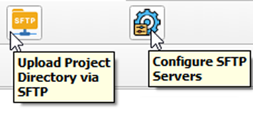

# QGIS SFTP Plugin

AcuGIS QGIS SFTP Plugin is a plugin for tranfering contents of a QGIS Project directory via SFTP.

## Features

- Store multiple target servers
- Set Owner (CHOWN)
- Transfer entrire directory contents, including sub folders.
  

## Uses:

- Any case in which you wish to transfer project directory via SFTP
- Lizmap
- QWC2

## Installation

Download acugis_sftp_tool.zip to your desktop

In QGIS, go to Plugins > Manage and Install Plugins and click on "Install from Zip" in left menu.

Browse to location where you saved acugis_sftp_tool.zip and then click "Install Plugin"

Once installed, you should see the Plugins menu.

## Configure Servers:

 

- Begin by selecting Configure SFTP servers:  

- Click Add to add server(s).

- Enter Server information

- Click Save.

## Upload via SFTP

Go to Upload Project Directory via SFTP

Select the Server you wish to upload to.  

Use the "Browse Remote Path" button to browse the remote directories, or simply enter the remote location (file path) to upload to (e.g. /var/www/html)

If your owner is a user:group other than wwww-data, change it in the Owbership field.

.. warning::
    The entire QGIS Project directory will be uploaded.

Click Upload

.. note::
    If files exist, you will prompted if you wish to overwrite files.
    
A success message will be displayed up completion.

## Toolbar Icons:

## Plugin Menu:

## Updates:

Added File Browser for selecting remote file location

## Use Cases

The plugin is generic and can be used for SFTP'ing a QGIS Project directory to any remote location via SFTP.

Some specific use cases are:

- Liamap: While it is still neccessary to create a Repository on disk and register it via Lizmap admin, once you have done so the plugin can transfer the project as well as update files as needed.

- QWC2: Can be used to upload to /scan directory.  Once uploaded, Configuration Utility must still be run for the project.

